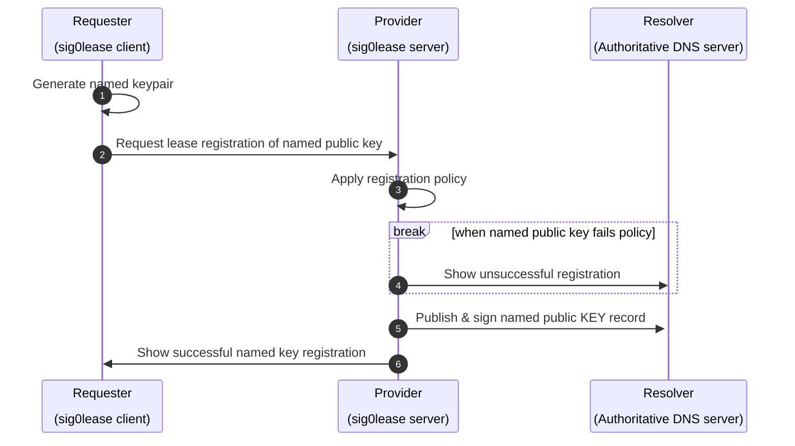
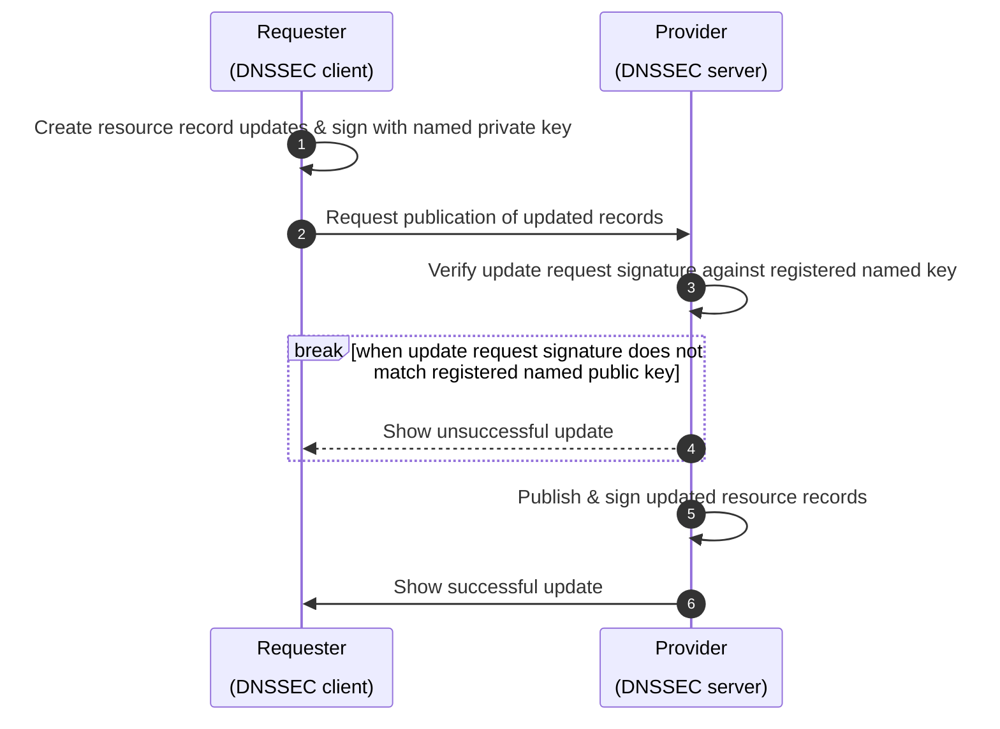

<h1 align="center">
  sig0lease</br>
  <sub></sub>
</h1>

<p align="center">
  to name is to own
</p>

<br><br>

<h4 align="center">
  <a href="#-prepare">📝 Prepare</a>
  <span> • </span>
  <a href="#-install">💾 Install</a>
  <span> • </span>
  <a href="#-quick-start">🎮 Quick start</a>
  <span> • </span>
  <a href="#-links">🌐 Links</a>
  <span> • </span>
  <a href="#-contributing">👤 Contributing</a>
  <span> • </span>
  <a href="#-license">💼 License</a>
</h4>


sig0lease is a reference implementation of DNS leases (as described in RFC 9664) together with an implementation of the Service Registration Protocol (described in RFC 9665) a sig0lease proxy server handles lease management for DNS updates on behalf of authoritative DNS resolvers for lease registrations and renewals by sig0lease clients. TThe concept of a DNS lease can be thought of as similar to a DHCP lease only it is a lease for a DNS name rather than for an IP address). 

Similar to sig0namectl, a SIG(0) KEY Resource Record (RR) is used as a secure DNS update method. A client may apply for registration of a DNS KEY lease that may be periodically refreshed. If the agreed lease time expires without renewal, the KEY RR and all other RRs leased through it are removed from the DNS zone. If the lease is renewed within the lease expiration time, then the leases are refreshed. While the KEY is active within the zone, DNS update rights are granted on a first come, first served (FCFS) basis.


<details id="toc">
 <summary><strong>🚩 Table of Contents</strong> (click to expand)</summary>

* [Prepare](#-prepare)
* [Install](#-install)
* [Quick start](#-quick-start)
* [Links](#-links)
* [Contributing](#-contributing)
* [License](#-license)
</details>

##  📝 Prepare

[TODO]


## ⛭ Build

To build the golang proxy server `sig0lease`, 

```
make sig0lease
```

To build the sig0lease client 'sig0client',
```
make sig0client
```

## 💾 Install

[TODO]

## 🎮 Quick start

### Lease Registration of a named key



By default, DNS key labels beneath a compatible domain zone can be claimed on a "First Come, First Served" (FCFS) basis.


The successful registration can be verified by

`dig mysubdomain.zenr.io KEY`

returning the listed public key for the specific FQDN.

the keypair is enabled to add, modify or delete any DNS resource record at or under [*.]*mysubdomain.zenr.io*.

Note: It may take a minute or so for your local DNS resolver to update its cache with the new key.

### Updating resource records with a named key



#### `dnssd-domain fqdn`

Manages DNS records necessary to activate wide area DNS Service Discovery browsing.

#### `dnssd-service fqdn`

Gives an *example* of how to register browsable wide area DNS-SD services.

***
**[🔝 back to top](#toc)**


## 😍 Acknowledgements

Copyleft (ɔ) 2022 Adam Burns, [free2air limited](https://free2air.net) & the [Dyne.org](https://www.dyne.org) foundation, Amsterdam

Designed, written and maintained by Adam Burns.

**[🔝 back to top](#toc)**

***
## 🌐 Links


**[🔝 back to top](#toc)**

***
## 👤 Contributing

1.  🔀 [FORK IT](../../fork)
2.  Create your feature branch `git checkout -b feature/branch`
3.  Commit your changes `git commit -am 'Add some fooBar'`
4.  Push to the branch `git push origin feature/branch`
5.  Create a new Pull Request
6.  🙏 Thank you


**[🔝 back to top](#toc)**

***
## 💼 License
    sig0lease - 
    Copyright (c) 2023 Adam Burns, free2air limited

    This program is free software: you can redistribute it and/or modify
    it under the terms of the GNU Affero General Public License as
    published by the Free Software Foundation, either version 3 of the
    License, or (at your option) any later version.

    This program is distributed in the hope that it will be useful,
    but WITHOUT ANY WARRANTY; without even the implied warranty of
    MERCHANTABILITY or FITNESS FOR A PARTICULAR PURPOSE.  See the
    GNU Affero General Public License for more details.

    You should have received a copy of the GNU Affero General Public License
    along with this program.  If not, see <http://www.gnu.org/licenses/>.

**[🔝 back to top](#toc)**
