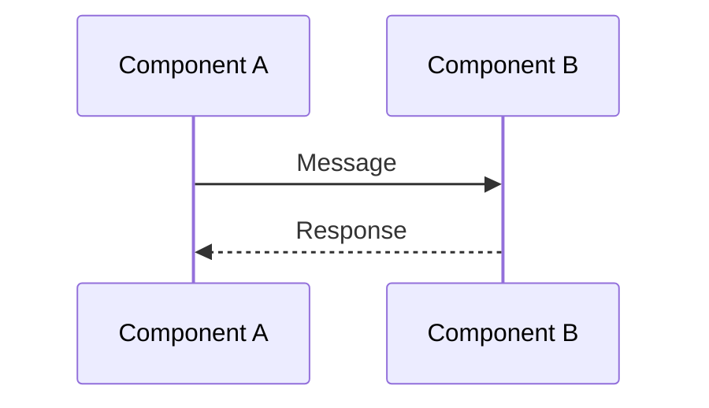
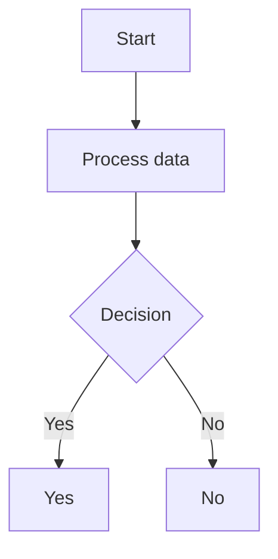
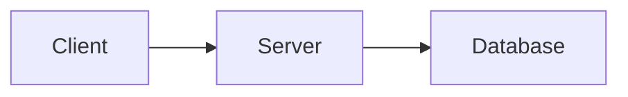

# Diagrams Directory

This directory contains Mermaid diagrams that describe the architecture and behavior of sig0lease.

## Available Diagrams

| File | Description |
|------|-------------|
| `registration-flow.mmd` | Complete SRP registration flow from client to server to DNS (RFC 9665 3.2.5, 3.3) |
| `lease-refresh.mmd` | Lease refresh mechanism, coalescing, and garbage collection (RFC 9664 5, RFC 9665 5) |
| `authentication-paths.mmd` | SIG0 vs TSIG authentication comparison (RFC 2931, RFC 8945) |
| `discovery-flow.mmd` | Registrar discovery via DNS (RFC 9665 3.1, RFC 8765) |
| `instruction-validation.mmd` | SRP instruction validation logic per RFC 9665 3.3 |
| `test-harness.mmd` | End-to-end test infrastructure against BIND 9 |
| `architecture-components.mmd` | Package structure and component relationships |

## Viewing the Diagrams

### Option 1: GitHub (Native Support)
GitHub renders Mermaid diagrams automatically in `.mmd` files when viewed in a browser.

### Option 2: Mermaid CLI
Install and use the mermaid-cli tool:

```bash
# Install via npm locally
npm install @mermaid-js/mermaid-cli

# Convert .mmd to PNG
./node_modules/.bin/mmdc -i registration-flow.mmd -o registration-flow.png

# Convert to PDF
./node_modules/.bin/mmdc -i registration-flow.mmd -o registration-flow.pdf

# Convert all diagrams (requires local installation of mermaid as described above)
./compMermaid.sh
```

### Option 3: Mermaid Live Editor
1. Go to https://mermaid.live
2. Copy-paste the content of a `.mmd` file
3. Edit and preview in real-time

### Option 4: VS Code Extension
Install the "Mermaid Preview" extension for on-save rendering.

## Editing Diagrams

All diagrams use a text-based syntax that is:
- **Git-friendly**: Diffable with standard git tools
- **Version-controllable**: Track changes like any other code
- **Collaborative**: Easy to review in PRs

To modify a diagram:
1. Edit the `.mmd` file directly
2. Preview using one of the viewing methods above
3. Commit changes with a descriptive message

## Diagram Format Reference

### Sequence Diagram (most common)


### Flowchart


### Component/Architecture


## Note on Special Characters

Mermaid has some parsing quirks with special characters. When editing:

- Avoid `()` in node labels - use spaces instead: `Accept loop` not `Accept()`
- Use words instead of symbols: `less than or equal to` not `<=`, `equals` not `=`
- Avoid double quotes `"` - use single quotes or words
- Avoid semicolons `;` in text - use commas or rewrite
- Use underscores `_` for subscripts (Mermaid treats them as special)

## Contributing

When adding new diagrams:
1. Use descriptive filenames (kebab-case)
2. Include RFC references in the diagram comments
3. Add entries to this README's table
4. Run `mmdc` to verify syntax before committing
