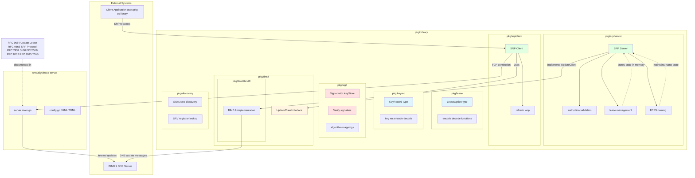
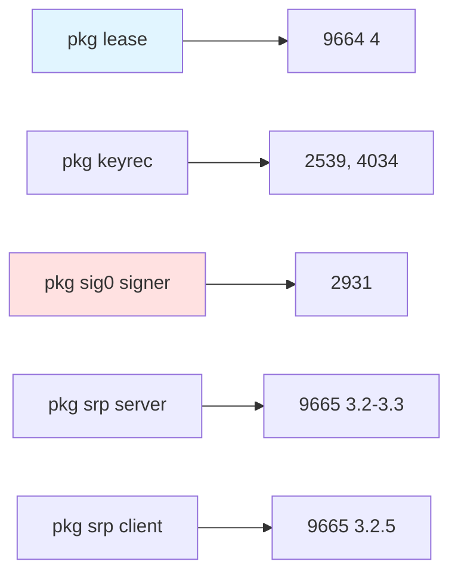
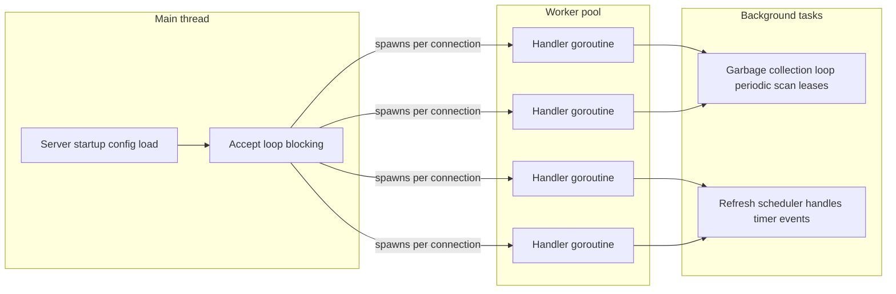

# sig0lease Architecture Components

## Overview
This diagram shows the package structure and component relationships.

## Component Responsibilities Matrix

## Data Flow: Full Registration

```mermaid
flowchart TD
    Start[Client Application] --> Build1[Build DNS Update Message]

    Build1 --> AddLease[Add Update Lease OPT pkg lease]
    AddLease --> AddKey[Add KEY RR pkg keyrec]
    AddKey --> AddPtr[Add PTR RR pkg srp instruction]
    AddPtr --> AddSrvTxt[Add SRV TXT RRs pkg srp instruction]

    AddSrvTxt --> Sign1[Sign Message pkg sig0 signer]

    Sign1 --> ClientSend[Send to SRP Server TCP connection]
    ClientSend --> ServerRecv[Server receives message]

    ServerRecv --> ValidateSig[Validate SIG0 TSIG pkg sig0 verifier]
    ValidateSig --> ParseUpdate[Parse DNS Update pkg srp server]

    ParseUpdate --> ValidateInst[Validate Instructions pkg srp server validate.go]
    ValidateInst --> CheckLease[Check Update Lease pkg lease validation]

    CheckLease --> FCFSName[FCFS Name Generation pkg srp names]

    FCFSName --> ForwardToUpdate[Forward to DNS Server dnsif updateclient.go]
    ForwardToUpdate --> BindImpl[Bind9 implementation dnsif bind9]

    BindImpl --> DnsUpdate[Send DNS Update to BIND 9]
    DnsUpdate --> RecvResponse[Receive Response RCODE]

    RecvResponse --> AddLeaseOpt[Add granted lease to response OPT]
    AddLeaseOpt --> SendResp[Send response to client]

    SendResp --> ClientRecv[Client receives NOERROR plus leases]
    ClientRecv --> ScheduleRefresh[Schedule refresh at 80 percent plus jitter]
```

## Thread Model

