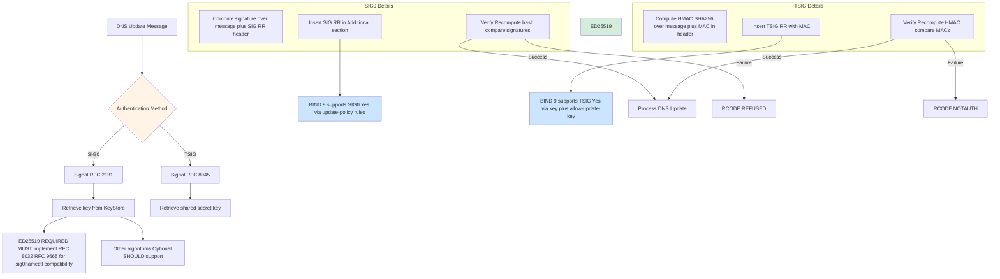
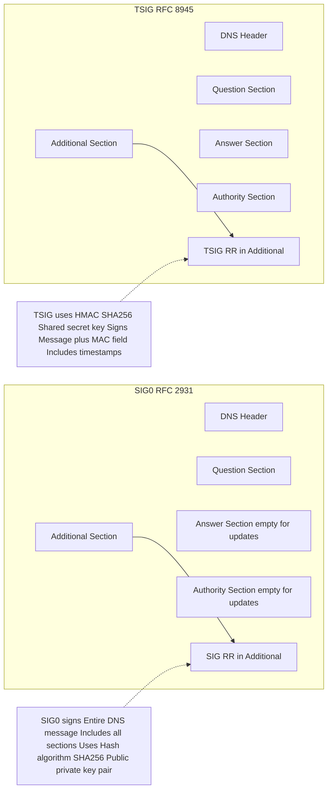
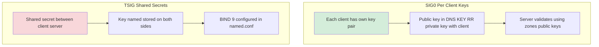
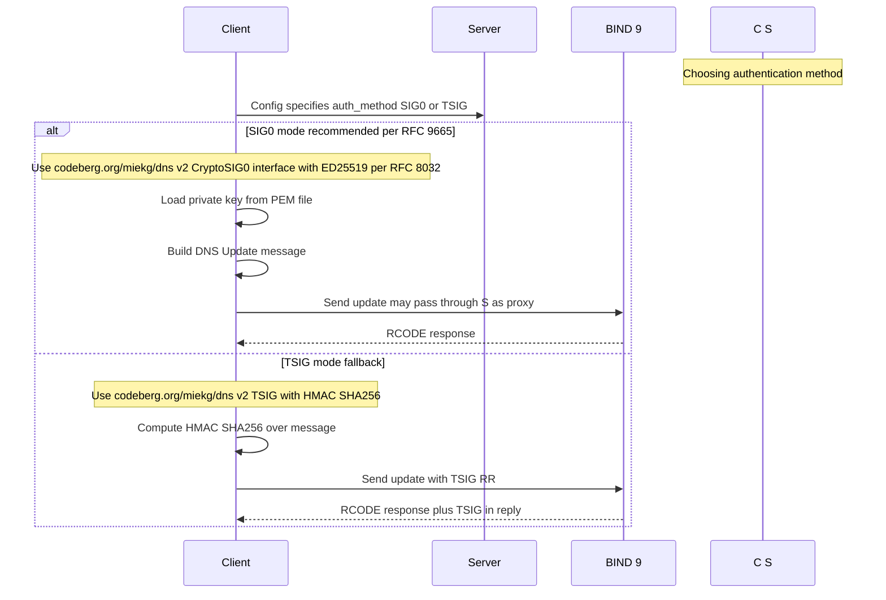

# Authentication Paths SIG0 vs TSIG

## Overview
This diagram compares the two authentication paths per RFC 2931 and RFC 8945.



## Message Structure Comparison



## Key Management Comparison



## Code Flow sig0lease Implementation



## Security Properties Comparison

| Property | SIG0 | TSIG |
|----------|------|------|
| Key type | Asymmetric ECDSA RSA | Symmetric shared secret |
| Key distribution | Public key in DNS private key with client | Shared out-of-band |
| Replay protection | Validity window plus signature | Timestamps plus MAC |
| Non-repudiation | Yes signature cant be forged | No shared secret |
| BIND 9 config | update-policy local or named rules | key name secret |
| RFC requirement | RFC 9665 6.6 MUST implement ED25519 per RFC 8032 for sig0namectl compatibility | RFC 8945 Optional |

## Recommended Approach for sig0lease

Per the project docs and RFC requirements:

1. **Primary**: SIG0 with ED25519 per RFC 8032
   - Required by RFC 9665 §6.6 for sig0namectl compatibility
   - Better security properties asymmetric non-repudiation
   - Public keys can be distributed via DNS

   Note: ED25519 (algorithm 15) is used instead of ECDSAP256SHA256 (algorithm 13)

2. **Fallback Alternative**: TSIG with HMAC SHA256
   - Supported for compatibility
   - Simpler key management in some deployments
   - Referenced in RFC 9665 7 TLS alternatives

3. **Implementation pattern**:
```go
// Use miekg/dns CryptoSIG0 interface
signer := &dns.CryptoSIG0{
    CryptoSigner: privateKey,
    PublicKey:    keyRecord,
}

err := dns.SIG0Sign(msg, signer, &dns.SIG0Option{})
```
