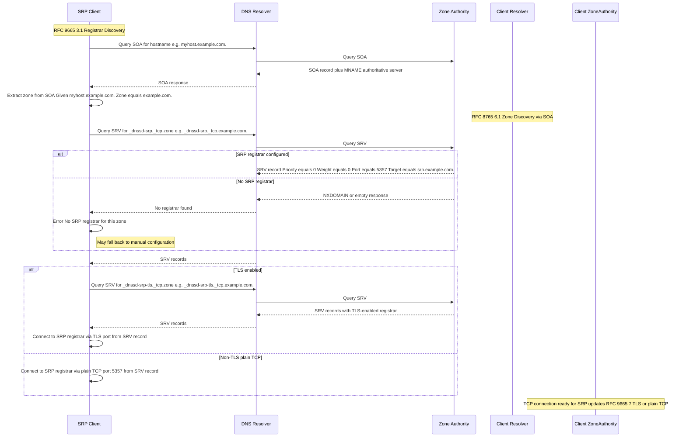
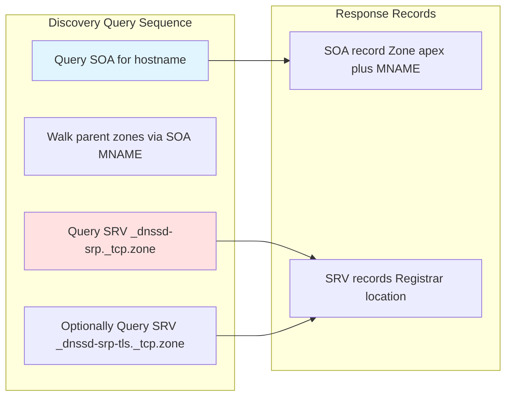
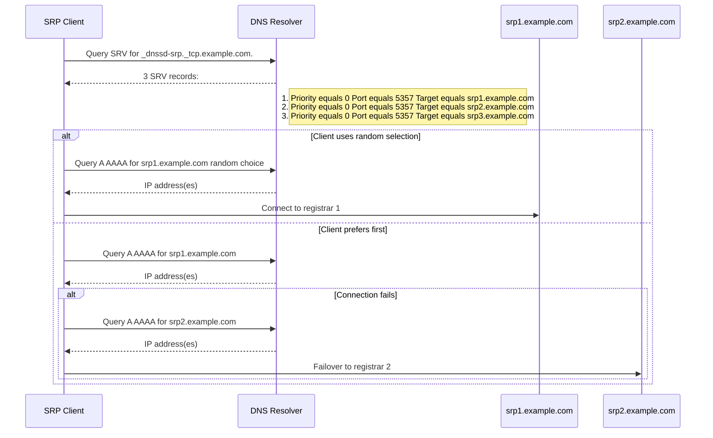
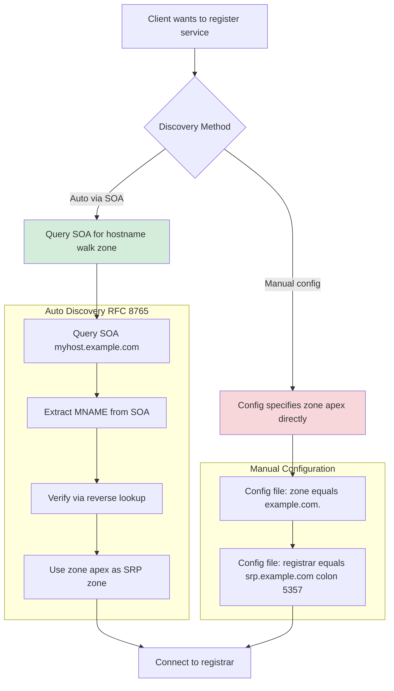
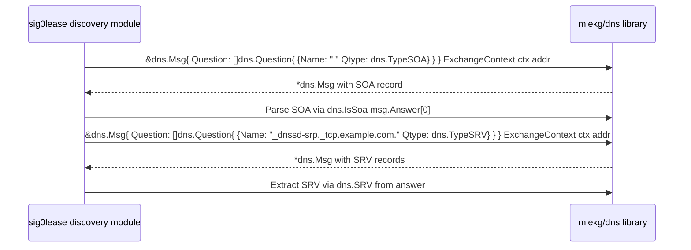

# Registrar Discovery Flow

## Overview
This diagram shows how the SRP client discovers the registrar per RFC 9665 3.1 and RFC 8765.

## DNS Records Used in Discovery

## Multiple Registrars Load Balancing

## Zone Discovery Alternatives

## Error Cases in Discovery

```mermaid
flowchart TD
    Start[Start discovery] --> Q1[Query SOA]

    Q1 -->|Success| ExtractZone[Extract zone apex]
    Q1 -->|NXDOMAIN| Err1[No such domain Return error]
    Q1 -->|SERVFAIL| Err2[DNS server failure Retry or error]

    ExtractZone --> Q2[Query SRV _dnssd-srp._tcp.zone]

    Q2 -->|Success with records| ParseSRV[Parse SRV records]
    Q2 -->|NXDOMAIN| Err3[No SRP registrar configured Use manual config fallback]
    Q2 -->|Empty response| Err4[Zone has no SRP registrar]

    ParseSRV --> ResolveAddr[Resolve target hostname to IP]
    ResolveAddr --> Connect[TCP connect to registrar]

    Connect -->|Success| Ready[Registrar ready]
    Connect -->|Connection refused| Err5[Registrar not listening Check port firewall]
    Connect -->|TLS handshake fail| Err6[TLS error Try non-TLS or fix certs]

    style Err1 fill:#f8d7da
    style Err2 fill:#f8d7da
    style Err3 fill:#f8d7da
    style Err4 fill:#f8d7da
    style Err5 fill:#f8d7da
    style Err6 fill:#f8d7da
    style Ready fill:#d4edda
```

## Integration with miekg dns

