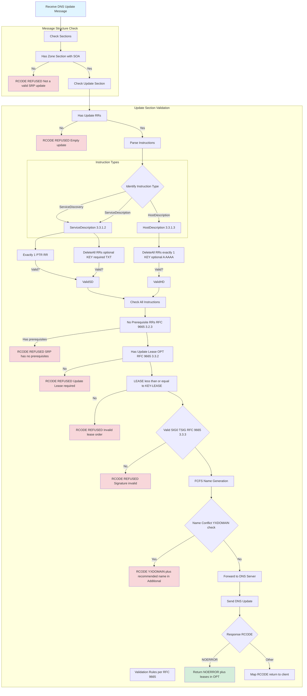
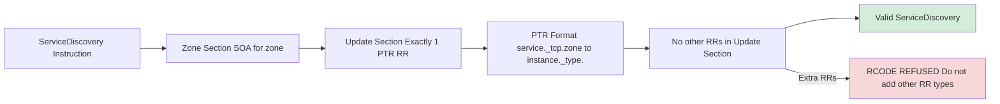
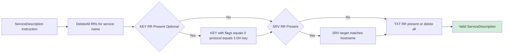
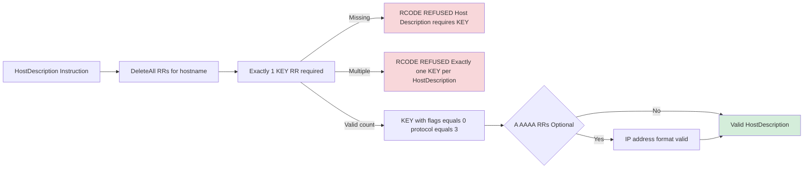
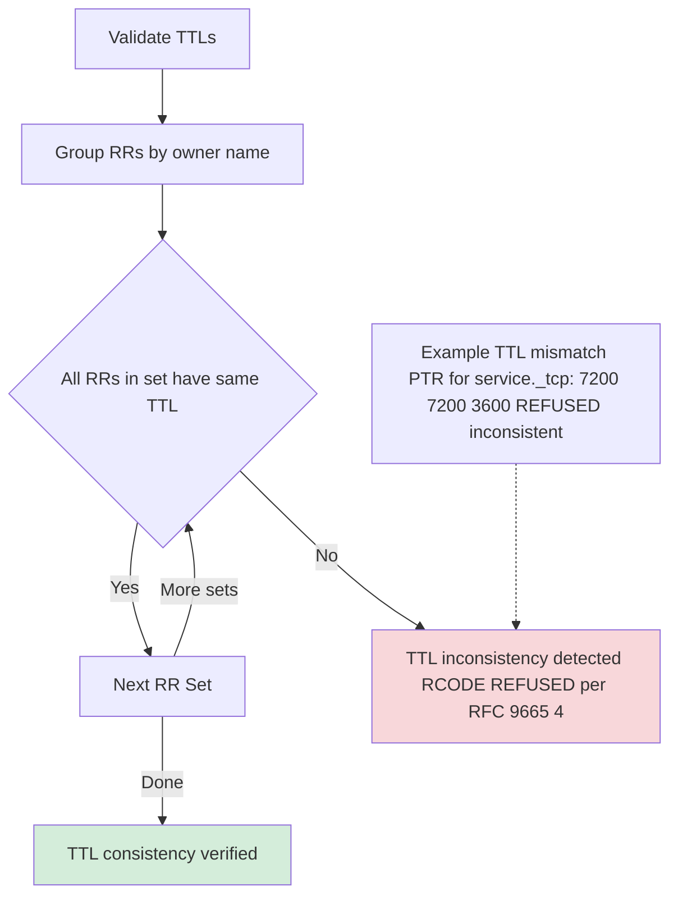
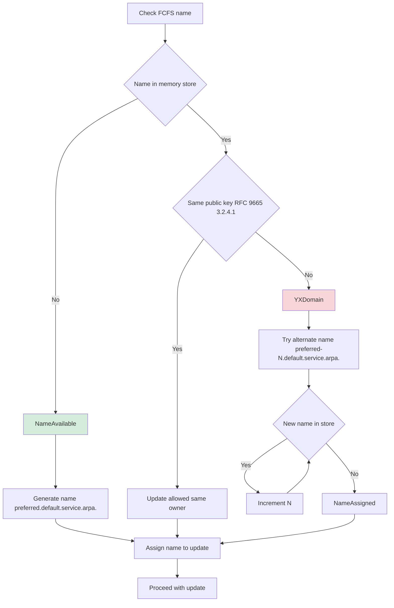
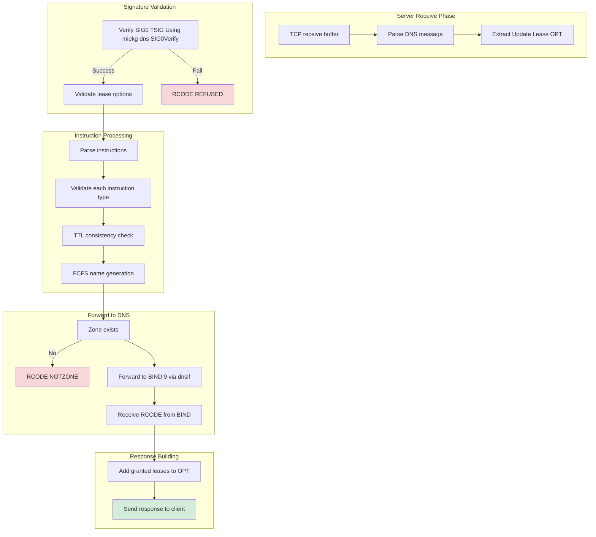

# SRP Instruction Validation Logic

## Overview
This diagram shows the instruction validation flow per RFC 9665 3.3.

## Instruction Type Details

### ServiceDiscovery RFC 9665 3.3.1.1

### ServiceDescription RFC 9665 3.3.1.2

### HostDescription RFC 9665 3.3.1.3

## TTL Consistency Check RFC 9665 4

## Name Conflict Detection FCFS

## Complete Validation Pipeline

