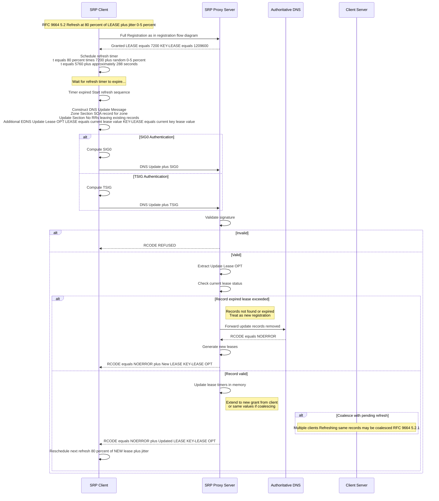
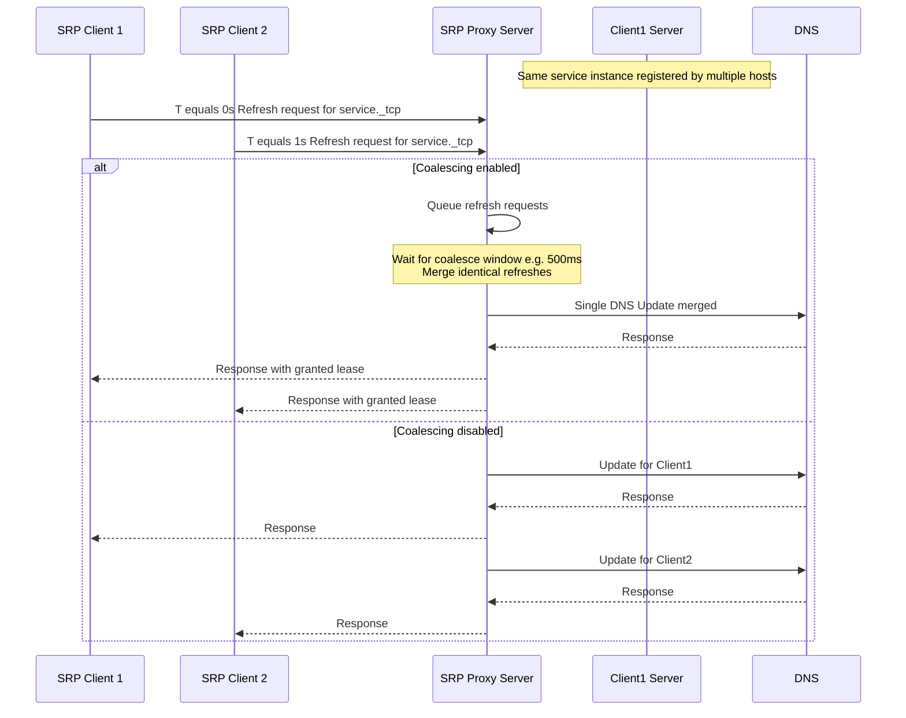
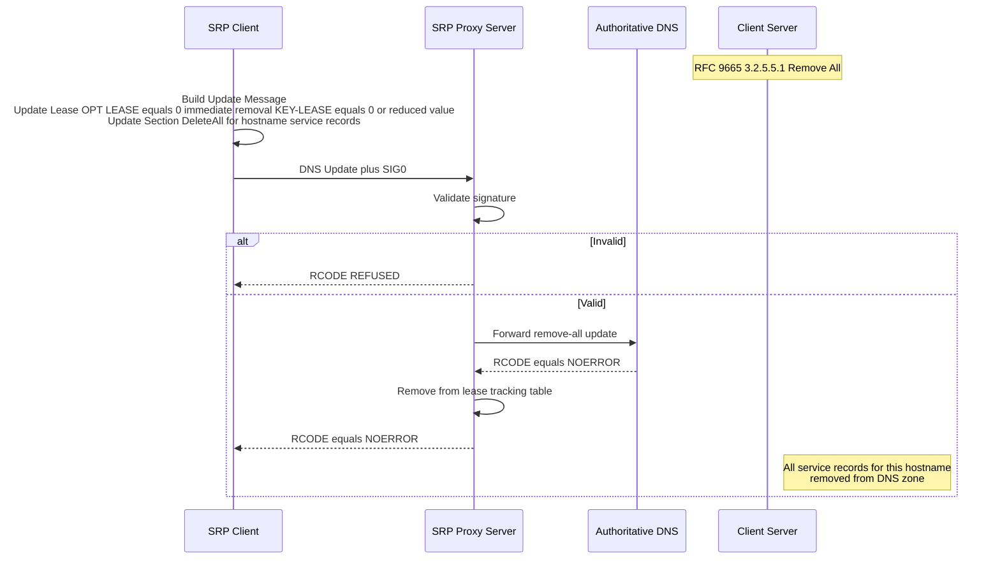
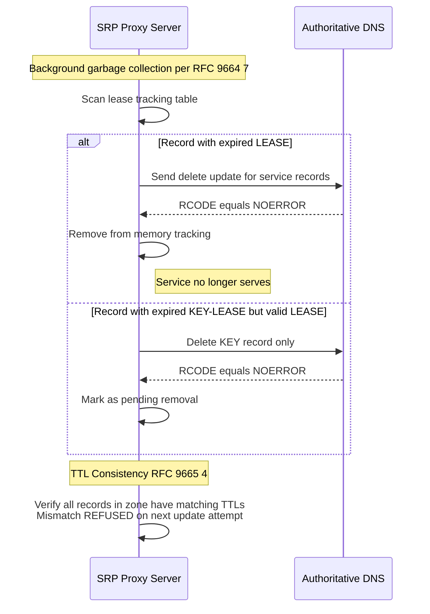

# SRP Lease Refresh Flow

## Overview
This diagram shows the lease refresh mechanism per RFC 9664 5 and RFC 9665 5.

## Coalesced Refreshes Multiple Clients

## Remove-All LEASE equals 0 Flow

## Lease Expiration and Garbage Collection

