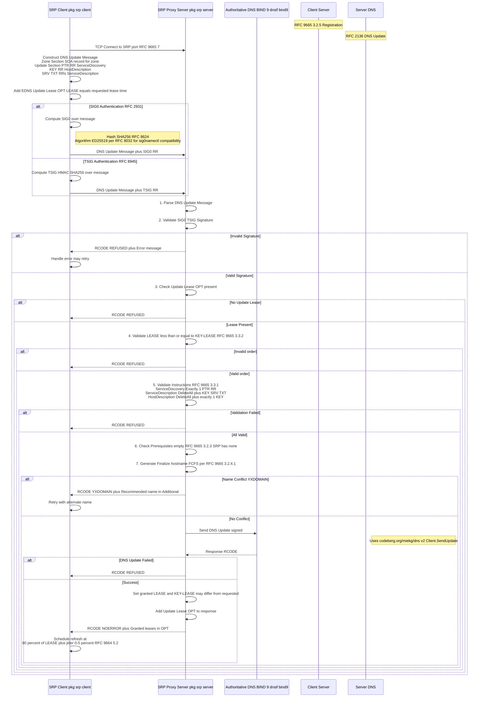

# SRP Registration Flow - Client to Server to DNS

## Overview
This diagram shows the complete SRP registration flow per RFC 9665 3.2.5 (Client) and 3.3 (Server Validation).



## Message Structure Reference

```
DNS Update Message RFC 1035 RFC 2136:
+---------------------+
| Header              | ID flags opcode equals UPDATE
+---------------------+
| Question Section    | Zone apex SOA query
+---------------------+
| Answer Section      | empty for updates
+---------------------+
| Authority Section   | empty for updates
+---------------------+
| Additional Section  | - Update Lease OPT EDNS0 opt equals 2<br/>- SIG0 or TSIG RR
+---------------------+

Update Section RRs:
- ServiceDiscovery: PTR instance._service._tcp.zone
- HostDescription: KEY [A] [AAAA]
- ServiceDescription: DeleteAll, [KEY], SRV, TXT
```

## Error Codes per RFC

| RCODE | Meaning | When it occurs |
|-------|---------|----------------|
| REFUSED | Server failure or invalid request | Invalid signature missing lease validation error |
| YXDOMAIN | Name exists when it should not | FCFS conflict detection |
| NOTAUTH | Not authoritative | Server not auth for zone |
