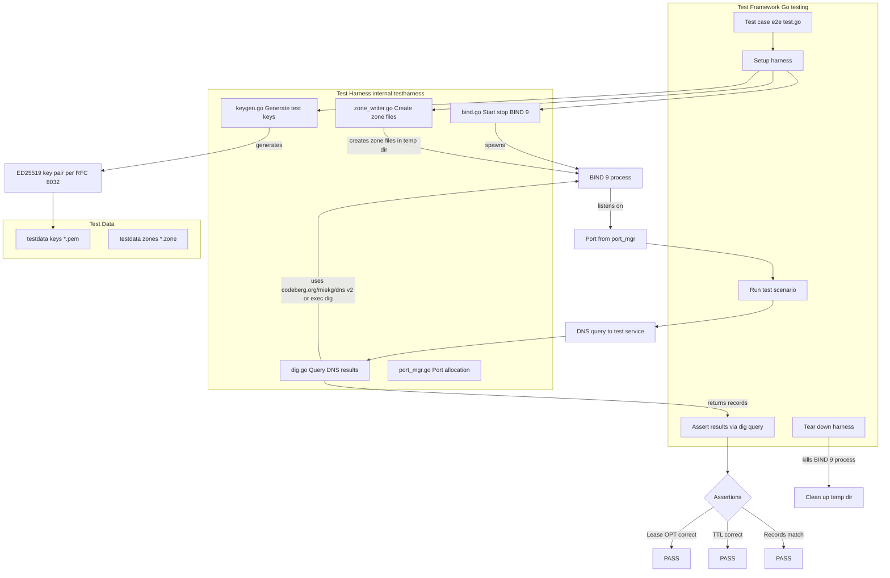
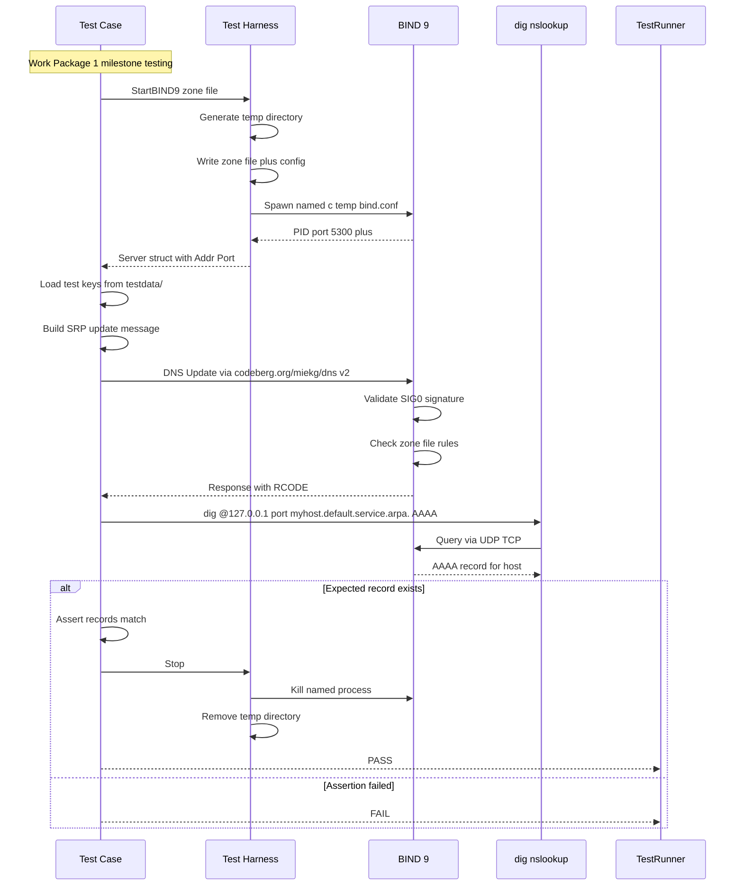
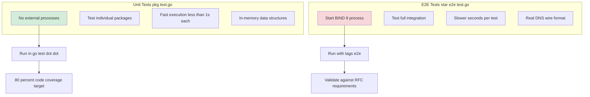
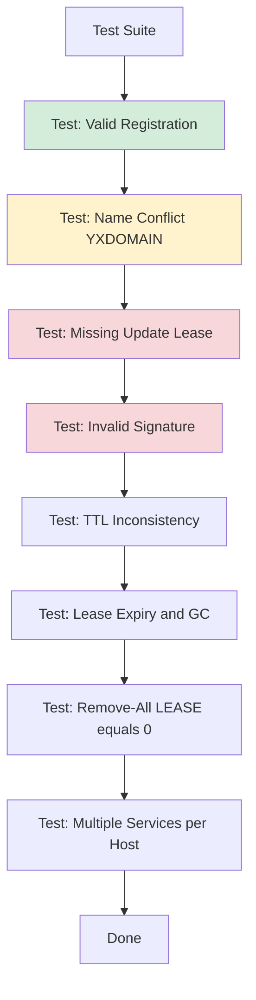
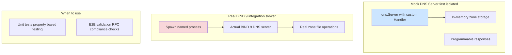

# Test Harness Architecture

## Overview
This diagram shows the end-to-end test infrastructure for testing against a real BIND 9 server.



## Test Flow Example



## Unit Tests vs E2E Tests



## Test Data Structure

```
testdata/
 ├── keys/                     ED25519 key pairs per RFC 8032
 │   ├── host1.pem            Private key plus public key for FCFS tests
 │   └── host2.pem            Second host key for conflict tests
├── zones/                    BIND 9 zone files
│   ├── default.service.arpa.zone
│   └── reverse.zone         Reverse mapping optional
└── bind.conf                Minimal BIND config
    options {
        directory /tmp/test-bind
        listen on port 5300 any
        allow-query any
        allow-update key test-key
    }
    zone "default.service.arpa." {
        type master
        file default.service.arpa.zone
    }
```

## Key Test Scenarios



## Mock vs Real BIND 9 Tests



## CI CD Integration

```mermaid
flowchart LR
    subgraph "Development"
        Dev[Test locally go test dot dot]
    end

    subgraph "CI Pipeline"
        CI1[go mod verify]
        CI2[Unit tests go test race]
        CI3[E2E tests go test tags e2e]
        CI4[Coverage report]
    end

    subgraph "Code Quality Gate"
        CQ1[Coverage greater than 80 percent]
        CQ2[E2E all pass]
        CQ3[Race detector clean]
    end

    Dev --> CI1
    CI1 --> CI2
    CI2 --> CI3
    CI3 --> CI4
    CI4 --> CQ1
    CQ1 -->|Yes| CQ2
    CQ2 -->|Yes| CQ3
    CQ3 -->|Yes| Merge[Ready for merge]

    style Dev fill:#d4edda
    style CQ1 fill:#fff3cd
    style Merge fill:#d4edda
```


