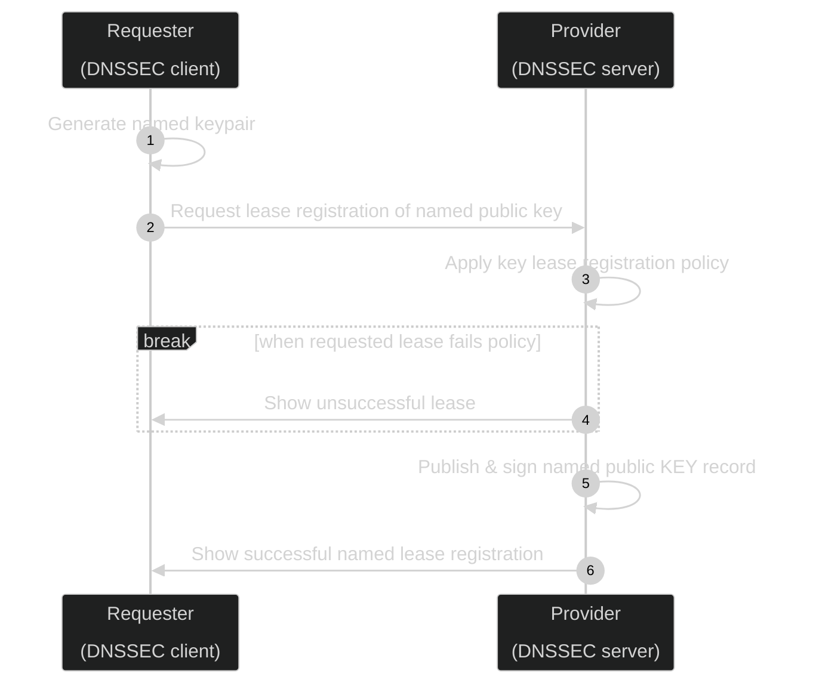

+++
title = 'README'
layout = 'posts'
date = 2026-08-19T13:12:15+02:00
draft = false
#featured_image = '/images/mycosystem-quarter.jpg'
featured_image = ""
toc = true
+++

## 🚧 Work in progress

sig0lease is a proxy DNS server and client that enable a real-time collaborative and secure method to publish wide area DNS Service Discovery to communities across the Internet. Standard SIG(0) key based authentication allows users to register and refresh their service discovery information as required.

##  📝 Prepare

Install dependencies.

To keep extra dependencies to a minimum and to allow use in constrained environments, these tools are implemented in Bash and use a subset of BIND9 DNS tools.

For Debian and derivatives:

`apt install golang-go bind9-dnsutils`

For Fedora and related distributions and derivates

`dnf install golang bind-utils`

## 💾 Install

Clone this git repository and use from working directory.

## 🎮 Quick start

To request a key lease registration to a proxy server bound to a compatible domain (*dev.zenr.io* is an example public playground), use the `sig0lease-client` tool, specifying the fully qualified domain name (FQDN) of the new key. For example, under the *dev.zenr.io* domain, issuing:

(this demonstration is using the keypair adam.dev.zenr.io pre-generated by dnssec-keygen)

`KEY_LEASE=120 RR_LEASE=60 CLIENT_KEYSTORE_DIR="${PWD}/keystore/client" ./bin/linux/sig0lease-client 127.0.0.1:8053 register Kadam.dev.zenr.io.+015+11035 ${RR_LEASE} ${KEY_LEASE} "adam.dev.zenr.io. ${KEY_LEASE} IN KEY 512 3 15 crZ4HIm84QcWX1ST+Ymi8W/X99N3XHs6pWExy7462Vw=" "adam.dev.zenr.io. ${RR_LEASE} IN A 10.10.0.1" "adam.dev.zenr.io. ${RR_LEASE} IN TXT \"Registration Example Text\""  `

Which will register and add the KEY record at adam.dev.zenr.io, as well as adding 2 other resources records:

- an 'A record' that maps a domain name to an IP address; and,
- a 'TXT record' that stores text information about that FQDN.

The KEY record itself is leased, and unless refreshed, when the lease expires (in this example, in 120 seconds) the KEY will be removed from DNS.

The A and TXT records are leased, and unless also refreshed by a request signed by that key, will expire in 60 seconds.

The successful registration can be verified by

`dig adam.dev.zenr.io KEY`

returning the listed public key for the specific FQDN.

the keypair is enabled to add, modify or delete any DNS resource record at adamb.dev.zenr.io*.

Note: It may take some time for your local DNS resolver to update its cache with the service definition.

***
**[🔝 back to top](#toc)**

## 😍 Acknowledgements

Copyleft (ɔ) 2022 Adam Burns, [free2air limited](https://free2air.net) & the [Dyne.org](https://www.dyne.org) foundation, Amsterdam

Designed, written and maintained by Adam Burns.

**[🔝 back to top](#toc)**

***
## 🌐 Links

**[🔝 back to top](#toc)**

***
## 👤 Contributing

1.  🔀 [FORK IT](../../fork)
2.  Create your feature branch `git checkout -b feature/branch`
3.  Commit your changes `git commit -am 'Add some fooBar'`
4.  Push to the branch `git push origin feature/branch`
5.  Create a new Pull Request
6.  🙏 Thank you

**[🔝 back to top](#toc)**

***
## 💼 License
    sig0lease - 
    Copyleft (ɔ) 2023 Adam Burns, free2air limited & Dyne.org foundation, Amsterdam

    This program is free software: you can redistribute it and/or modify
    it under the terms of the GNU Affero General Public License as
    published by the Free Software Foundation, either version 3 of the
    License, or (at your option) any later version.

    This program is distributed in the hope that it will be useful,
    but WITHOUT ANY WARRANTY; without even the implied warranty of
    MERCHANTABILITY or FITNESS FOR A PARTICULAR PURPOSE.  See the
    GNU Affero General Public License for more details.

    You should have received a copy of the GNU Affero General Public License
    along with this program.  If not, see <http://www.gnu.org/licenses/>.

**[🔝 back to top](#toc)**
